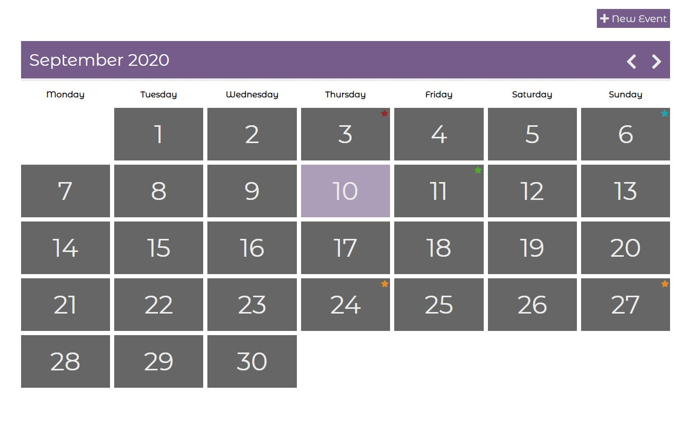
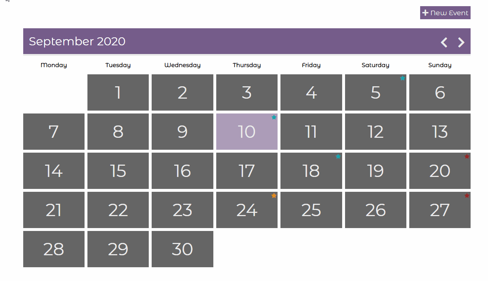

<h1 align="center">Event Calendar React</h1>



## Description

The calendar is implemented in React.js. Allows you to add, edit, delete events. You can switch between months. All events are stored in ```localstorage```

## Where to begin:
- Clone the repository https://github.com/VladimirOlishevsky/event-calendar-react.git
- Set ```yarn``` dependencies
- Start a ```yarn start``` project.

## Working with the project:

The ```New Event``` button allows you to add an event. In the window that opens, fill in:
- event name
- date
- time
- participant
- event description

The ```Add Event``` button adds events on the specified day. You can view current events by clicking on the relevant date. In the calendar days viewer, you can view entire events, edit or delete events.

